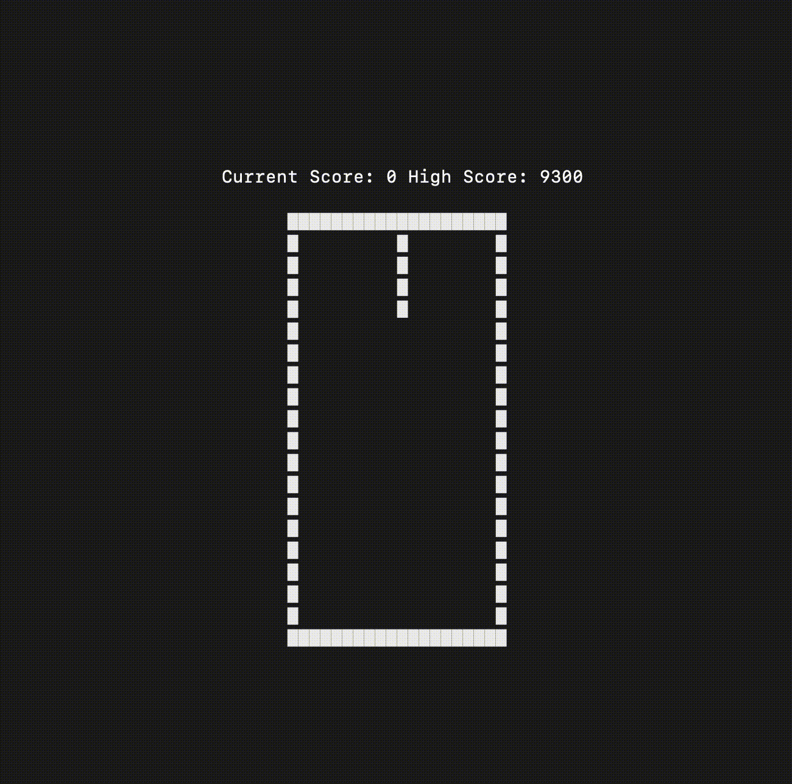

# Tetris
My command line implementation of tetris in rust

### Getting started
1. Clone this repo
2. `cargo run`
3. Controls 
  * Use the arrow keys or 'w', 's', and 'd' to move 'Left', 'Down' or 'Right'
  * Or use vim keybindings to move a tetromino left (h), right (l), and down (j)
  * Press 'Spacebar' or 'r' to rotate a tetromino
  * Press 'q' to quit
  * The highest score is saved to HIGH_SCORE