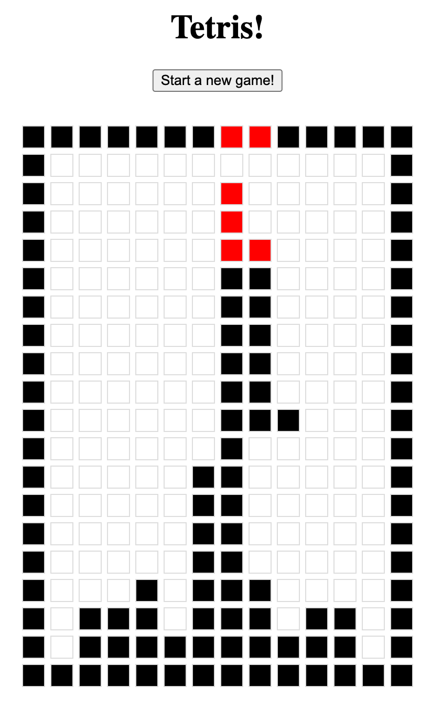

# Tetris
* A tetris game engine backend API built with rust

Example frontend built that interfaces with this API:


### Getting started

#### Rust Binary

* Start the backend API

```bash
cargo run --bin rust_tetris
```
